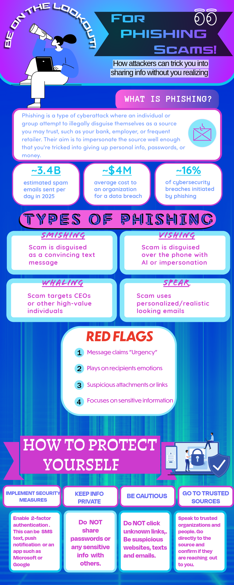

# L10: Infographic on a Security Concept

**Module:** L10  
**Points:** 100  
**Type:** Group Activity

---

## Description

In this group assignment, we collaboratively designed an infographic that visually explains a security concept. Our group chose phishing as our topic, covering what it is, the different types (smishing, vishing, whaling, and spear phishing), common red flags to watch out for, and practical steps people can take to protect themselves. The infographic was designed to be visually engaging and accessible to a general audience.

## Visual

## Reflection

This was probably the most creative assignment of the semester and I genuinely enjoyed it. Phishing is one of the most common and dangerous cybersecurity threats out there and being able to break it down visually in a way that a non-technical person could understand felt like real-world practice for what cybersecurity professionals actually have to do. Communicating complex security concepts clearly to a general audience is a skill that does not get talked about enough in this field. Working with a partner on the design and content also pushed me to think about how to present information concisely, which is harder than it looks.

---

*[Back to Portfolio Home](../README.md)*
