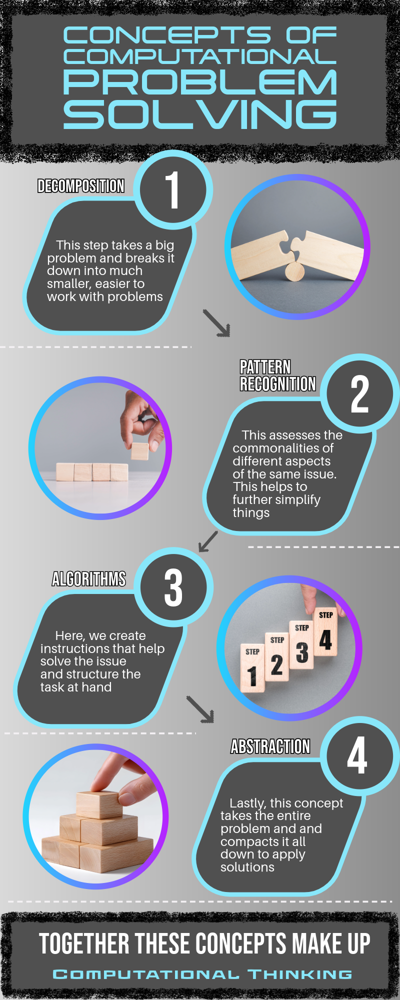

# L03: Computational Problem Solving Infographic

**Module:** L03  
**Points:** 10  
**Type:** Individual Assignment

---

## Description

For this assignment I used Adobe Express to create an infographic explaining the four key concepts of computational problem solving: decomposition, pattern recognition, algorithms, and abstraction. The infographic was designed to walk the viewer through each concept in order, showing how together they make up computational thinking.

## Visual

## Reflection

This was my first time creating an infographic from scratch and it pushed me to think about how to communicate technical concepts visually rather than just in writing. Breaking down computational thinking into four distinct steps and illustrating each one forced me to actually understand the concepts well enough to explain them simply. The design process also gave me early practice with Adobe Express, which I ended up using again later in the semester for the group phishing infographic.

---

*[Back to Portfolio Home](../README.md)*
